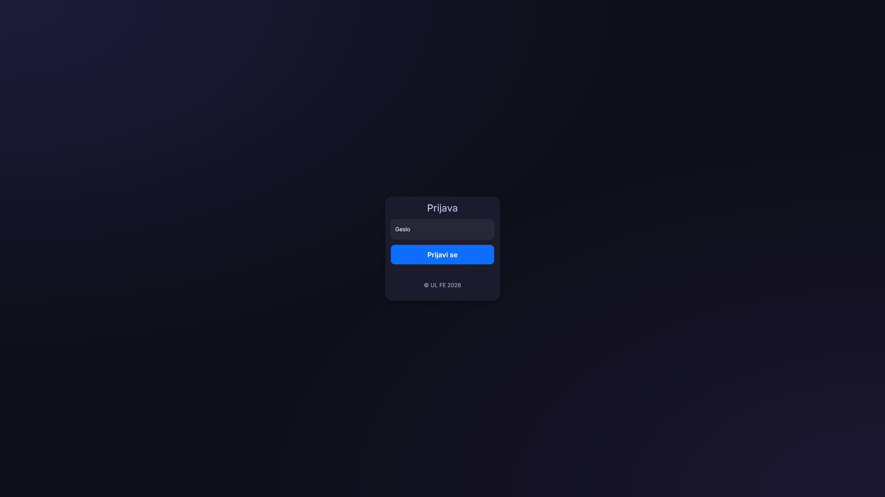
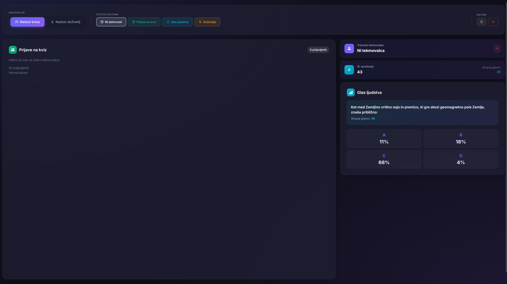
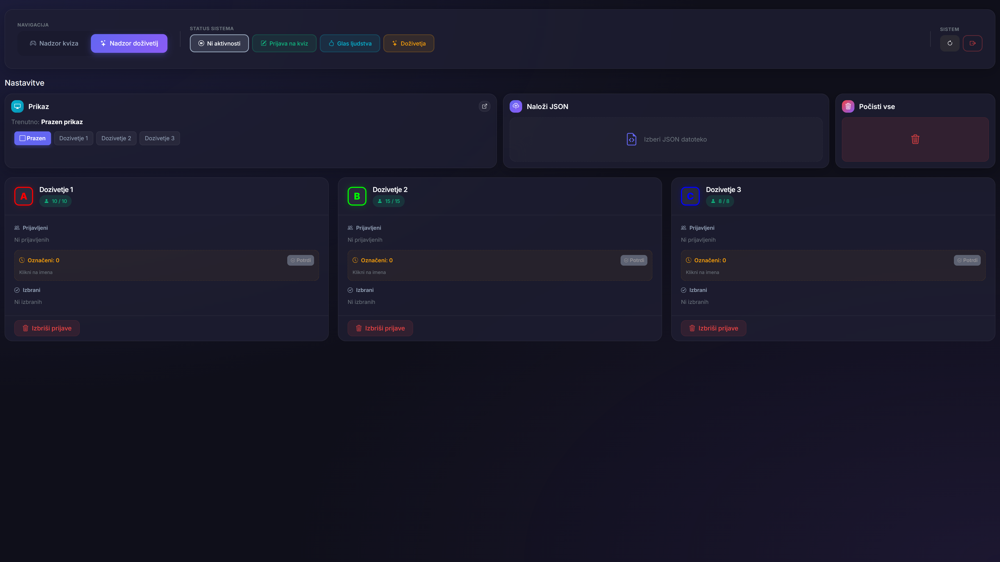
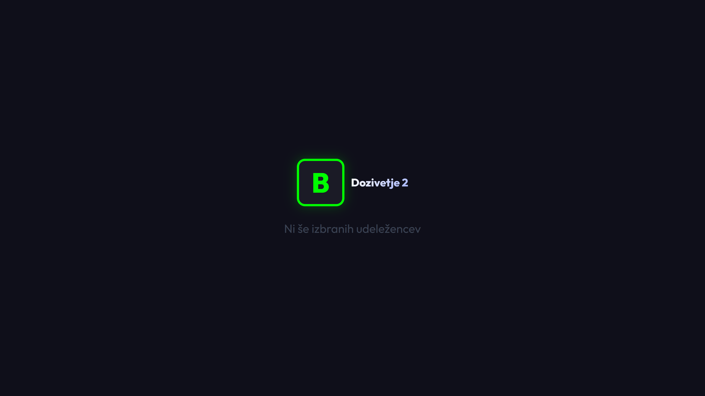
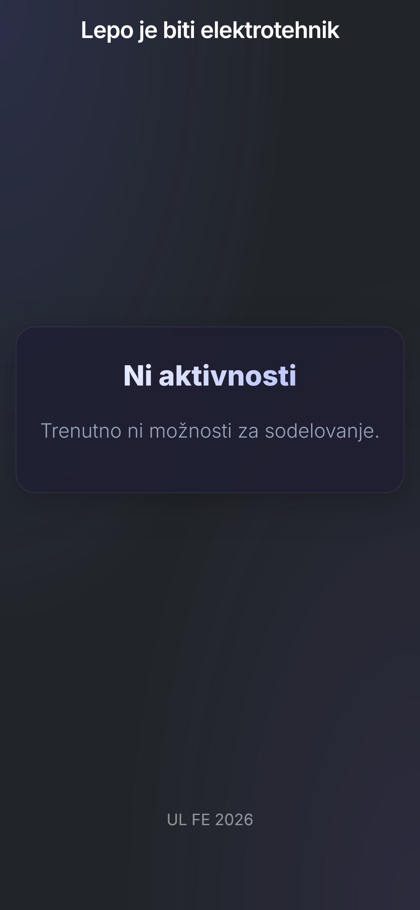
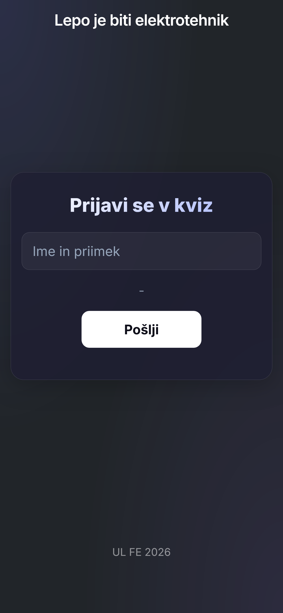
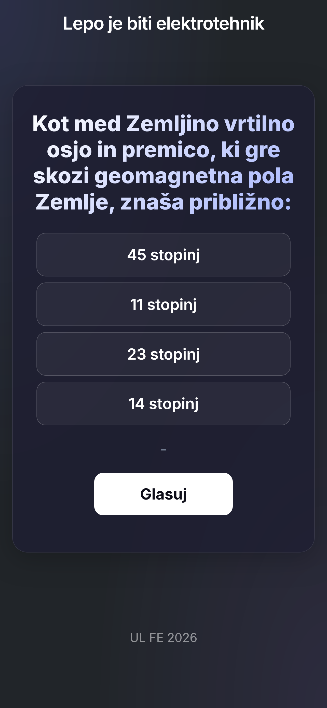
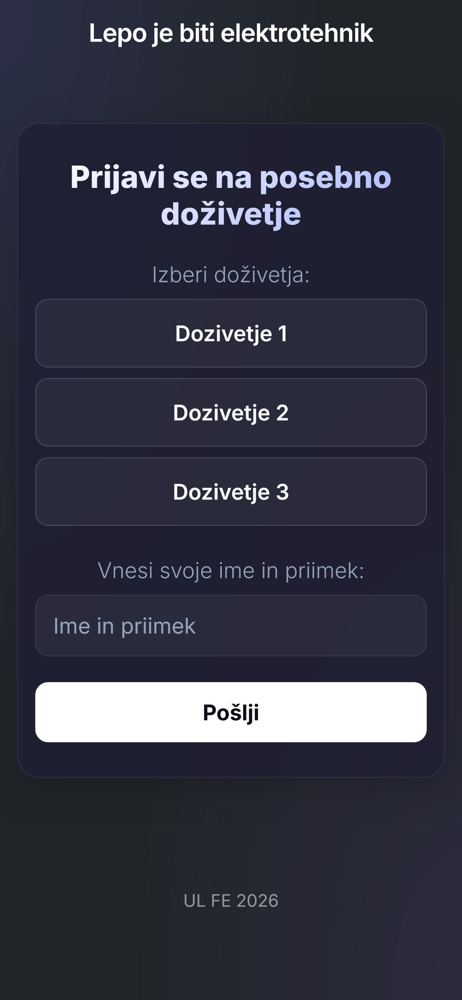
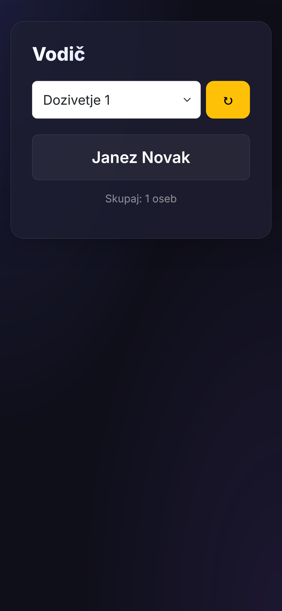

# Lepo je biti elektrotehnik - Spletna Aplikacija

Moderna spletna aplikacija za upravljanje kviza "Lepo je biti elektrotehnik" in interaktivnih doživetij. Odlikuje jo premijski "glassmorphism" uporabniški vmesnik, AJAX osveževanje v realnem času ter prilagojeni pogledi za mobilne naprave in administratorko upravljanje.

## Ključne funkcionalnosti

### Upravljanje kviza

- **Prijava tekmovalcev v živo**: Hitra in enostavna registracija udeležencev na dogodku.
- **Nadzorna plošča**: Izbira tekmovalcev in upravljanje stanj igre preko osrednjega vmesnika.
- **Glas ljudstva**: Interaktivno glasovanje občinstva za odgovore na vprašanja (A/B/C/D).
- **Statistika v realnem času**: Takojšen prikaz odstotkov glasovanja z AJAX samodejnim osveževanjem.

### Sledenje doživetjem (Doživetja)

- **Uvoz JSON**: Hitra nastavitev razpoložljivih doživetij preko JSON datotek.
- **Upravljanje kapacitet**: Samodejno štetje prostih mest in sledenje razpoložljivosti.
- **Nadzor udeležencev**: Enostavna izbira in brisanje prijavljenih oseb za posamezno doživetje.
- **Namenski prikazi**: Specializirani pogledi za projekcijo ali informativne zaslone.

### Varnost in zmogljivost

- **Preprečevanje podvajanja**: Zaščita na podlagi sej (session) za glasovanje in prijave.
- **Varno upravljanje**: Administracijski paneli so zaščiteni z geslom.
- **Visoka odzivnost**: Testirano za delovanje do 600 sočasnih uporabnikov.

## Tehnologije

- **Ozadje (Backend)**: PHP 8.1+
- **Baza podatkov**: MySQL 5.7+ / MariaDB
- **Vmesnik (Frontend)**: Bootstrap 5.3, Bootstrap Icons, pisava Inter
- **Dizajn**: Prilagojen Glassmorphism UI (premium.css)

## Namestitev

1. **Kopirajte repozitorij** v korensko mapo vašega spletnega strežnika (npr. `htdocs` za XAMPP).
2. **Nastavitev baze podatkov**:
   - Ustvarite bazo z imenom `elektrotehnik`.
   - Uvozite datoteko `mysql/elektrotehnik.sql`.
3. **Konfiguracija**:
   - Kopirajte `server_data.sample.php` v `server_data.php`.
   - V `server_data.php` vstavite podatke za dostop do baze in nastavite `ADMIN_PASSWORD`.
4. **Dostop**:
   - Uporabniški pogled: `index.php`
   - Nadzorna plošča: `nadzor.php` (privzeto geslo v vzorcu: `elektro`)

## Struktura projekta

- `index.php`: Glavna stran za udeležence.
- `nadzor.php`: Nadzorna plošča za kviz.
- `nadzor_dozivetja.php`: Nadzorna plošča za doživetja.
- `css/premium.css`: Osrednji stilski sistem.
- `api_*.php`: Backend dostopne točke za posodobitve v živo.

## Slike zaslona (Screenshots)

### Administratorski pogledi in Prikaz

|                  Prijava

|                  Nadzor kviza

|                  Nadzor doživetij

|                  Prikaz doživetja

### Uporabniški pogledi

|                       Mirovanje                       |                    Prijava na kviz                    |                      Glasovanje                       |                   Izbira doživetja                    |
| :---------------------------------------------------: | :---------------------------------------------------: | :---------------------------------------------------: | :---------------------------------------------------: |
|  |  |  |  |

### Vodič

|              Splošni pogled za vodiče              |                Izbira v pogledu za vodiče                 |
| :------------------------------------------------: | :-------------------------------------------------------: |
|  |  |

## Licenca

MIT Licenca - Razvito s strani UL FE 2026
